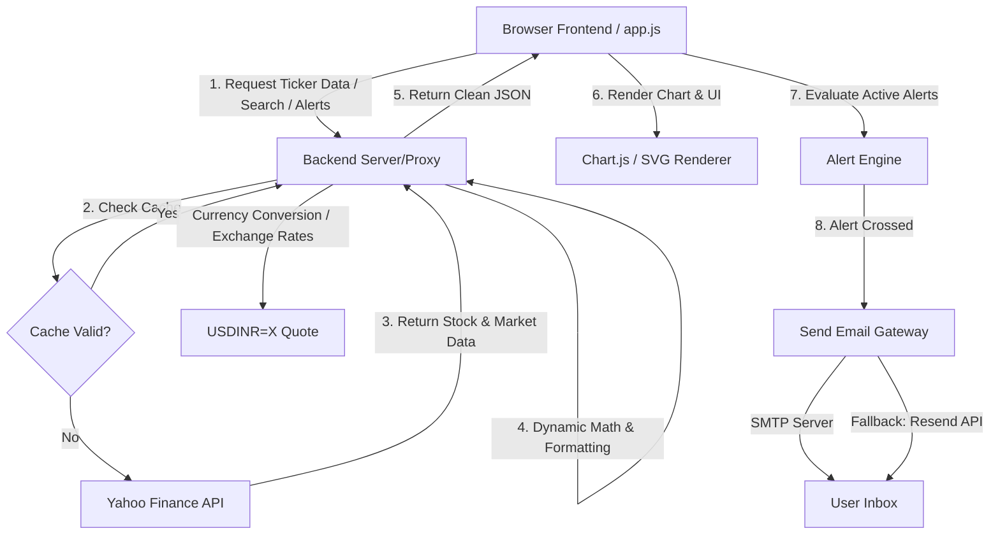

# Bull Trend AI - Project Documentary Report

Welcome to the comprehensive documentary report for **Bull Trend AI**, a premium, interactive stock tracking and analysis dashboard designed for modern retail investors. This report documents the vision, architecture, technology stack, data pipelines, deployment pipelines, AI/forecasting methodologies, and development challenges encountered during the project's evolution.

---

## 🎯 1. Project Aim & Vision

The primary objective of **Bull Trend AI** is to empower retail investors by providing a high-fidelity, unified stock market dashboard focusing on both **Indian Equities (NSE/BSE)** and **US Equities** under a single elegant user interface.

Key elements of our vision include:
*   **Aesthetic Excellence:** Implementing a premium, dark-themed Glassmorphism user interface designed to feel futuristic and interactive, featuring smooth transitions, clean typography, and responsive layouts.
*   **Cross-Border Accessibility:** Automatically performing real-time currency conversion (USD to INR) using live exchange rates to allow Indian investors to view and compare global stocks in their home currency.
*   **Proactive Alert Engine:** Enabling users to set precise price-target alerts with reliable SMTP and API-based email notifications, as well as simulated SMS warnings when target margins are breached.
*   **Algorithmic Analytics:** Providing built-in technical indicators (RSI, SMAs) and regression-based projections to give traders algorithmically backed price forecast bands without leaving the app.

---

## 🛠️ 2. Comprehensive Tech Stack & Tools

To build a robust, zero-cost, and easily deployable product, we selected a lightweight, high-performance, and modern tech stack.

### Frontend
*   **Core Structure & Design:** Semantic **HTML5** and custom **CSS3** utilizing modern Glassmorphism (backdrop-filters, semi-transparent border strokes, neon metallic gradients, and subtle glow animations).
*   **Typography:** Google Fonts integration featuring **Space Grotesk** (for geometric, high-tech header branding) and **Outfit** (for readable UI controls and tickers).
*   **Application Logic:** Vanilla **ES6+ JavaScript** handling local state, view switching (Dashboard, Portfolio, Alerts, Predict, Insights, Global Markets, Trade, and About), custom event handlers, and data binding.
*   **Visualizations:** **Chart.js** coupled with the `chartjs-plugin-zoom` plugin for high-performance interactive charting with custom gradient fills.
*   **Custom Charting:** A separate custom SVG-based interactive chart renderer (`chart.js`) for a lightweight, alternative visualization experience.

### Backend & Serverless
*   **Local Development Server:** A zero-dependency **Python 3** HTTP server (`server.py`) leveraging standard library modules (`http.server`, `urllib.request`, `concurrent.futures`, and `socketserver`). It simulates Netlify serverless routing locally.
*   **Production Serverless API:** **Node.js** running on **Netlify Functions** (`netlify/functions/stock.js`), delivering server-to-server data-fetching workflows to bypass browser restrictions.

### Database & Authentication
*   **Storage Engine:** **SQLite** (`db.sqlite3`) managed through a dedicated Python abstraction layer (`database.py`).
*   **Security:** Cryptographic password hashing implemented with **PBKDF2-HMAC-SHA512** combined with randomized 60-character salt strings.
*   **Schema Layout:** Structuring tables for `users` (credentials and avatar states), `watchlist` (user-saved tickers), and `alerts` (tracking pricing targets, conditions, and email logs).

### APIs & Messaging
*   **Financial Data Provider:** **Yahoo Finance API** (via direct REST calls on serverless endpoints and the `yfinance` package in Python for fundamental stock metrics).
*   **Email Notification Gateways:** Dual integration consisting of standard **SMTP protocol** (e.g., Gmail App Passwords) and the **Resend API** as a highly reliable fallback channel.

---

## 🔄 3. Data & Communication Pipelines

The system is designed around a secure, server-mediated data pipeline that prevents browser-level errors and maximizes request efficiency.



### The Request Lifecycle
1.  **Search & Autocomplete:** As the user types in the search bar, the client fires a query to the backend proxy search endpoint (`action=search`). The proxy queries the Yahoo Search API, parses out equity symbols, caches the result for 10 minutes, and returns a clean array to update the suggestion dropdown instantly.
2.  **Stock Analysis & Charting:** When a ticker is tracked, the client requests chart coordinates (`action=chart`). The backend pulls historical price charts and key metadata (P/E ratio, Market Cap, 52-Week High/Low, Day High/Low, and descriptions).
3.  **Local Threaded Parallelism:** For the "Top 10 Movers" panel, fetching multiple quotes sequentially is slow. The backend queries them in parallel—using a Python `ThreadPoolExecutor` locally and `Promise.all` in the Netlify function—slashing load times.
4.  **Real-Time Currency Engine:** US stocks are stored in USD. The backend automatically fetches the current `USDINR=X` chart quote, isolates the latest conversion rate, performs the currency multiplication, and returns clean, unified rupee values to the dashboard.
5.  **Alert Execution:** The frontend alert engine compares the current stock price against target conditions. If triggered, it posts to `/send_email`, prompting the backend to send an alert email via SMTP or the Resend API, showing a visual alert toast to the user.

---

## 🤖 4. AI & Technical Projections (Technical Stock Projection Engine)

The **AI Predict** system uses an algorithmic Technical Projection Engine (`prediction.js`) to parse historical pricing trends and project future bands without relying on heavy external machine learning frameworks.

The engine uses a multi-factor forecasting algorithm:
1.  **Linear Regression Trend Line:**
    *   Extracts the last 60 trading sessions.
    *   Calculates the mathematical slope ($m$) and intercept ($c$) of the pricing trend.
    *   Projects the slope into the user-selected horizon (7, 30, or 90 days), applying a time-decay factor to keep long-term trend lines realistic.
2.  **Relative Strength Index (RSI 14) Mean Reversion:**
    *   Computes the RSI over a 14-day window.
    *   Identifies overbought states ($RSI > 70$) and oversold states ($RSI < 30$).
    *   Applies a mean-reversion correction factor (shifting predictions down in overbought conditions and up in oversold conditions).
3.  **Simple Moving Average (SMA) Alignment:**
    *   Computes the SMA-20 and SMA-50.
    *   A bullish alignment ($SMA20 > SMA50$) adds a positive bias, while a bearish alignment adds a negative bias.
4.  **Volatility-Based Confidence Bands:**
    *   Measures historical volatility using the standard deviation of log returns.
    *   Uses the mathematical formula $CurrentPrice \times Volatility \times \sqrt{Days}$ to draw high-confidence upper and lower bands around the projected target price.
5.  **Confidence Score Calculator:**
    *   Generates a dynamic confidence score (ranging from 35% to 88%) based on history length, indicator agreement, and trend stability.

---

## 🚀 5. Deployment Pipelines

The application is prepared for two pathways of deployment, maximizing flexibility:

### 1. Production Hosting (Netlify & Render)
*   **Frontend & Serverless Backend:** Deployed to **Netlify**. The `netlify.toml` file instructs the platform to host static files (`index.html`, `app.js`, `style.css`, `logo.png`, `chart.js`, `prediction.js`) and compile serverless endpoints inside `netlify/functions`. Deployment can be executed via Netlify CI/CD (GitHub hooks) or by dragging a zipped folder onto Netlify Drop.
*   **Python Service:** Configured for **Render** via `render.yaml`. Render reads `requirements.txt` to install `yfinance` and runs `server.py` as a web service, exposing endpoints through specified environment ports.

### 2. Local Desktop Execution
To make local running simple, the project contains a zero-dependency script:
*   Double-clicking [run.bat](file:///c:/Users/Thiru/Github%20projects/BULL_TREND_AI/run.bat) boots up Python's local HTTP server.
*   The script uses a registry workaround in `server.py` to ensure proper MIME types are registered for `.css` and `.js` files, avoiding common Windows browser blocking bugs.

---

## ⚡ 6. Struggles Faced & Key Engineering Solutions

Throughout the development lifecycle, we overcame several severe technical obstacles:

### 1. Browser CORS Restrictions & Yahoo Blocking
*   **The Struggle:** Initially, data was fetched directly from the browser. Strict CORS headers and Yahoo blocking public proxy servers (like `allorigins` and `codetabs`) caused charts to crash frequently.
*   **The Solution:** We migrated all queries to serverless handlers (`netlify/functions/stock.js` and `server.py`). Requests originating from server IPs are not restricted by CORS and bypass browser blocks.

### 2. Financial API Pricing & Region Locks
*   **The Struggle:** We attempted to integrate a professional API provider (**TwelveData**). However, we discovered their free tier blocks Indian stock data (NSE/BSE), which is critical for our user base.
*   **The Solution:** We reverted to the Yahoo Finance API, routing queries through our custom serverless proxy functions which filter, format, and deliver the necessary Indian data at no cost.

### 3. CSS Stacking Contexts (Z-Index Bug)
*   **The Struggle:** Autocomplete suggestions were rendering behind the "Top 10 Movers" panel. This was caused by CSS `backdrop-filter` rules on the panel creating a new stacking context, rendering standard `z-index` rules ineffective.
*   **The Solution:** Resolved by setting relative positioning explicitly on the search parent elements and forcing a higher z-index container structure in `style.css`.

### 4. Hosting Mail Restrictions
*   **The Struggle:** Cloud hosts block traditional SMTP port `25` to prevent spam, making standard email notifications fail once deployed.
*   **The Solution:** We implemented a dual SMTP and API gateway. The code tries SMTP first and automatically falls back to sending POST payloads to the **Resend API** endpoint, securing email delivery across all hosts.

### 5. Windows Local Server MIME Staking
*   **The Struggle:** On Windows systems, Python's built-in `SimpleHTTPRequestHandler` occasionally fails to serve `.js` or `.css` files with correct MIME types due to corrupt registry keys, causing browsers to refuse execution.
*   **The Solution:** We added an explicit override in `server.py` that hooks into Python's `mimetypes` registry, forcing correct content types dynamically.

---

## 📂 7. Project Codebase Architecture

```
BULL_TREND_AI/
│
├── netlify/
│   └── functions/
│       └── stock.js       # Production Node.js Serverless Function (Data fetching & email)
│
├── index.html             # Main Dashboard UI Layout (Glassmorphism design structure)
├── app.js                 # Frontend core logic, chart controller, and UI bindings
├── chart.js               # Lightweight SVG-based chart renderer
├── prediction.js          # Technical stock forecasting engine (RSI, Regression, Volatility)
├── style.css              # Custom styling definitions (Neon effects, modal glass, z-indices)
│
├── server.py              # Zero-dependency local Python mock-server & API proxy
├── database.py            # SQLite database schema, user creation, and alert tracking
│
├── netlify.toml           # Netlify build configuration
├── render.yaml            # Render web-service deployment instructions
├── requirements.txt       # Python server dependencies (yfinance)
├── run.bat                # Windows quick-launch command file
└── PROJECT_HISTORY_AND_CHAT_BACKUP.md  # Historical log of updates and iterations
```

---

## 📝 8. Conclusion

**Bull Trend AI** is a testament to how complex browser limits, region-locked APIs, and deployment hurdles can be systematically bypassed using thoughtful proxying, fallbacks, and mathematical algorithms. The resulting software represents a high-performance, cost-effective, and aesthetically stunning investment cockpit suitable for modern trading analytics.
